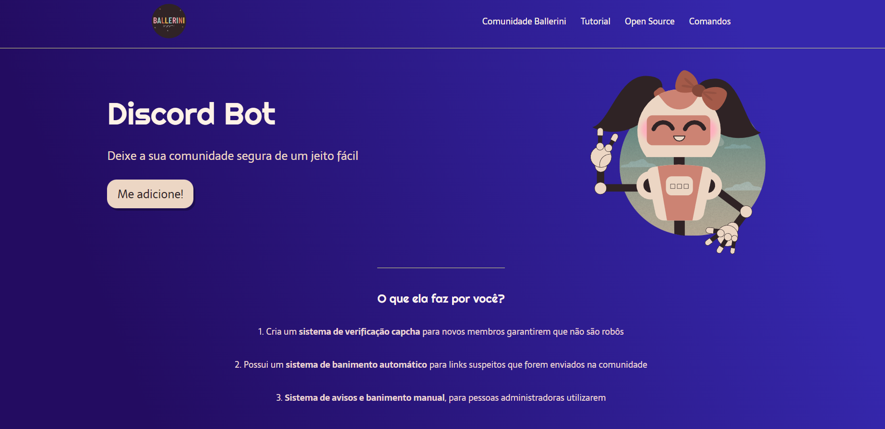

Esse projeto foi desenvolvido seguindo o vídeo tutorial da Rafaella Ballerini, vídeo em que ela ensina a criar uma landing page para um bot do Discord.
 
Meu interesse no projeto se deu em fixar conceitos HTML e CSS em um projeto de fato.

<h2>Canal do youtube da Rafaella Ballerini:</h2>https://www.youtube.com/@rafaellaballerini

<h2>Print do resultado do projeto</h2>
